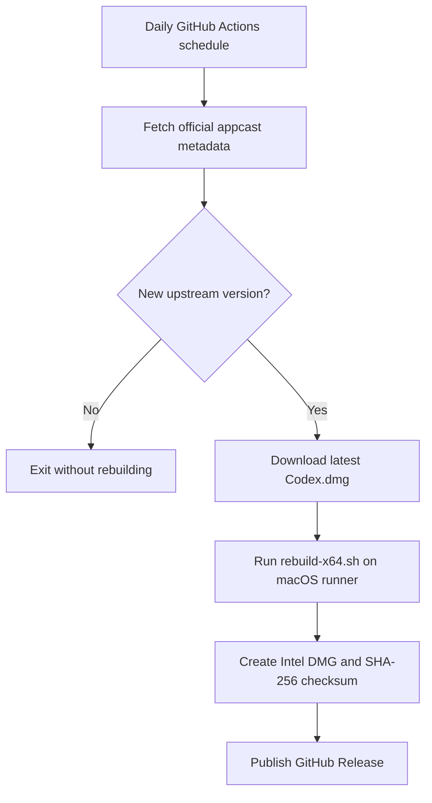

# Codex macOS x64

[简体中文](./README.zh-CN.md)

Repository name: `isnl/codex-macos_x64`

[](https://github.com/isnl/codex-macos_x64/actions/workflows/build-codex-x64.yml)
[](https://github.com/isnl/codex-macos_x64/releases)
[](https://github.com/isnl/codex-macos_x64/releases)
[](./LICENSE)
[](https://www.apple.com/macos/)
[](https://github.com/isnl/codex-macos_x64/releases)

> Unofficial Intel rebuild automation for the Codex macOS app.

Quick links: [Releases](https://github.com/isnl/codex-macos_x64/releases) | [Actions](https://github.com/isnl/codex-macos_x64/actions) | [Upstream Changelog](https://developers.openai.com/codex/changelog?type=codex-app)

An unofficial automation toolkit that rebuilds the latest official Codex macOS app from Apple Silicon (`arm64`) into an Intel (`x86_64`) DMG, then publishes the artifact to GitHub Releases on a daily schedule.

This repository is intended for users who still need to run the Codex desktop app on Intel Macs.

This project is not affiliated with OpenAI.

## Why This Exists

The official Codex desktop app is distributed for Apple Silicon, while some users still rely on Intel Macs. This project keeps an Intel-friendly build pipeline available by automatically repackaging each new upstream release into a downloadable `x86_64` DMG.

## Download

The fastest way to get started is from the latest GitHub Release:

- Download the latest Intel build: [Latest Release](https://github.com/isnl/codex-macos_x64/releases/latest)
- Download the latest release assets list: [All Releases](https://github.com/isnl/codex-macos_x64/releases)

Each release includes:

- `codex-macos-x64-<version>.dmg`
- `codex-macos-x64-<version>.dmg.sha256`

## Install and Verify

1. Download the DMG and its matching `.sha256` file from the latest Release.
2. Verify the checksum:

```bash
shasum -a 256 -c codex-macos-x64-<version>.dmg.sha256
```

3. Open the DMG and drag `Codex.app` into `Applications`.
4. On first launch, right-click the app and choose `Open`.
5. If macOS shows a security warning because this rebuilt app is not notarized by Apple, run:

```bash
xattr -dr com.apple.quarantine /Applications/Codex.app
```

The original upstream signature cannot be reused here. Once the app bundle is modified and repackaged for Intel, the original signature becomes invalid and macOS treats the rebuilt app as a new unsigned distribution unless it is signed and notarized again.

## What This Repository Does

- Downloads the latest upstream Codex macOS DMG for Apple Silicon.
- Rebuilds native modules for `darwin-x64`.
- Swaps the main Electron binaries and helper apps to Intel-compatible versions.
- Re-signs the rebuilt app with an ad-hoc signature.
- Packages the final app into an Intel DMG.
- Publishes the artifact to GitHub Releases automatically when a new upstream version is detected.

## Support Matrix

| Item | Status |
| --- | --- |
| Target platform | macOS Intel (`x86_64`) |
| Upstream source | Official Codex macOS Apple Silicon DMG |
| Delivery channel | GitHub Releases |
| Signing | Ad-hoc |
| Notarization | Not included |
| Auto-update | Disabled in rebuilt package |

## Repository Layout

- [rebuild-x64.sh](./rebuild-x64.sh): local rebuild script for macOS.
- [scripts/resolve-latest-release.mjs](./scripts/resolve-latest-release.mjs): resolves the latest upstream version metadata.
- [.github/workflows/build-codex-x64.yml](./.github/workflows/build-codex-x64.yml): scheduled GitHub Actions workflow for build and release.
- [.gitignore](./.gitignore): excludes local DMGs and rebuild artifacts.

## How Version Detection Works

The official Codex changelog is a useful human-readable reference:

- https://developers.openai.com/codex/changelog?type=codex-app

For automation, this project uses the official Sparkle appcast feed:

- https://persistent.oaistatic.com/codex-app-prod/appcast.xml

Why the appcast feed is used for CI:

- It provides the exact app version and build number.
- It reflects the currently published upstream build.
- It is better suited for machine parsing than the changelog page in automated environments.

The upstream Apple Silicon DMG URL is:

- https://persistent.oaistatic.com/codex-app-prod/Codex.dmg

## How The Automation Works



## GitHub Actions Automation

The workflow runs every day at `00:00` China Standard Time.

- GitHub Actions uses UTC, so the cron expression is `0 16 * * *`.
- The workflow checks whether a GitHub Release already exists for the latest upstream version.
- If the Release already exists, the job exits without rebuilding.
- If a new upstream version is available, the workflow downloads the latest DMG, rebuilds the Intel package, generates a checksum, and publishes both files to GitHub Releases.

## Quick Start

1. Create a GitHub repository named `codex-macos_x64`.
2. Push the contents of this project to `isnl/codex-macos_x64`.
3. Open the repository on GitHub and enable Actions.
4. Run the workflow manually once from the Actions tab to verify permissions and the first release.
5. After that, let the daily schedule handle future releases.

## Release Format

- Git tag: `v<upstream-version>`
- Release title: `Codex macOS x64 v<upstream-version>`
- Artifact: `codex-macos-x64-<upstream-version>.dmg`
- Checksum: `codex-macos-x64-<upstream-version>.dmg.sha256`

## Local Usage

Requirements:

- macOS
- Xcode Command Line Tools
- Node.js
- `pnpm`

Run locally:

```bash
./rebuild-x64.sh /path/to/Codex.dmg
```

Or place the upstream DMG in the project root as `Codex.dmg` and run:

```bash
./rebuild-x64.sh
```

The rebuilt DMG will be written to:

```text
output/Codex-x64.dmg
```

## FAQ

### Is this an official OpenAI build?

No. It is an unofficial repackaging workflow built around the official Codex app.

### Why is auto-update disabled?

The rebuilt Intel package is not a standard upstream distribution, so bundled auto-update components are intentionally removed to avoid invalid update behavior.

### Can the original upstream signature or notarization be reused?

No. The upstream Codex app is modified during the rebuild process, including binary replacement, native module replacement, signature cleanup, and repackaging. Those changes invalidate the original signature, so the final Intel build must either be distributed as an ad-hoc signed app or be signed and notarized again with a valid Apple Developer identity.

### Why does the workflow use `appcast.xml` instead of scraping the changelog page?

The appcast feed is structured, versioned, and better suited for automation. The changelog page remains useful for humans, but is less reliable as a machine interface.

### Does this run on Linux or Windows?

No. The rebuild process depends on macOS-specific tooling such as `hdiutil`, `codesign`, `lipo`, and `ditto`, so the workflow runs on GitHub's macOS runners.

## Notes and Caveats

- This is an unofficial Intel rebuild.
- The rebuilt app is ad-hoc signed and not notarized.
- Auto-update is intentionally disabled in the rebuilt package.
- The upstream app and related trademarks belong to OpenAI.
- Because the upstream DMG URL is static, version detection is based on appcast metadata rather than the DMG filename.

## Acknowledgements

Special thanks to:

- [ry2009/codex-intel-mac](https://github.com/ry2009/codex-intel-mac) for the original community work and inspiration behind this rebuild approach.
- Codex for helping write and refine the rebuild script and project documentation.

## License

This project is released under the MIT License. See [LICENSE](./LICENSE).

## Star History

[](https://star-history.com/#isnl/codex-macos_x64&Date)
