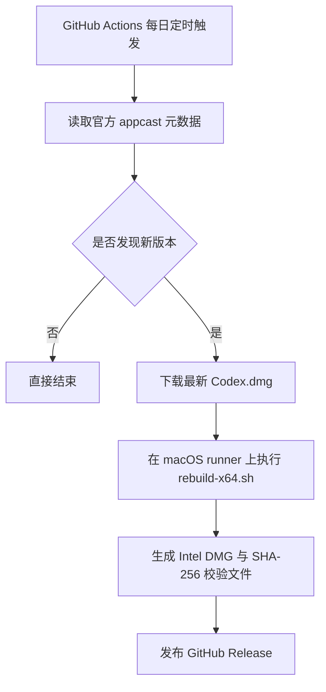

# Codex macOS x64

[English](./README.md)

仓库名称：`isnl/codex-macos_x64`

[](https://github.com/isnl/codex-macos_x64/actions/workflows/build-codex-x64.yml)
[](https://github.com/isnl/codex-macos_x64/releases)
[](https://github.com/isnl/codex-macos_x64/releases)
[](./LICENSE)
[](https://www.apple.com/macos/)
[](https://github.com/isnl/codex-macos_x64/releases)

> 一个面向 Codex macOS 应用的非官方 Intel 重打包自动化项目。

快速入口：[Releases](https://github.com/isnl/codex-macos_x64/releases) | [Actions](https://github.com/isnl/codex-macos_x64/actions) | [上游更新日志](https://developers.openai.com/codex/changelog?type=codex-app)

这是一个非官方自动化项目，用来把官方的 Codex macOS Apple Silicon 版本（`arm64`）重打包成 Intel Mac 可用的 `x86_64` DMG，并在检测到上游新版本时自动发布到 GitHub Releases，方便用户下载。

这个仓库面向仍然需要在 Intel Mac 上运行 Codex 桌面应用的用户。

本项目与 OpenAI 没有关联。

## 为什么会有这个项目

官方 Codex 桌面应用主要面向 Apple Silicon，而一部分用户仍然在使用 Intel Mac。这个项目的目标，就是在每次上游发布新版本时，自动重打包出一个可下载的 `x86_64` DMG，尽量降低 Intel 用户的使用门槛。

## 下载

最快的使用方式是直接从最新的 GitHub Release 下载：

- 下载最新 Intel 构建：[Latest Release](https://github.com/isnl/codex-macos_x64/releases/latest)
- 查看全部历史版本：[All Releases](https://github.com/isnl/codex-macos_x64/releases)

每个 Release 会包含：

- `codex-macos-x64-<version>.dmg`
- `codex-macos-x64-<version>.dmg.sha256`

## 安装与校验

1. 从最新 Release 下载 DMG 和对应的 `.sha256` 文件。
2. 先校验文件完整性：

```bash
shasum -a 256 -c codex-macos-x64-<version>.dmg.sha256
```

3. 打开 DMG，把 `Codex.app` 拖到 `Applications`。
4. 首次启动时，右键应用并选择 `Open`。
5. 如果 macOS 隔离属性影响启动，可以执行：

```bash
xattr -dr com.apple.quarantine /Applications/Codex.app
```

## 这个仓库能做什么

- 下载最新的官方 Codex macOS Apple Silicon DMG。
- 重新编译 `darwin-x64` 所需的原生模块。
- 替换主 Electron 二进制和各个 helper app，使其兼容 Intel。
- 对重打包后的应用进行 ad-hoc 签名。
- 将最终应用重新打包为 Intel DMG。
- 在检测到上游新版本时，自动发布到 GitHub Releases。

## 支持范围

| 项目 | 状态 |
| --- | --- |
| 目标平台 | macOS Intel (`x86_64`) |
| 上游来源 | 官方 Codex macOS Apple Silicon DMG |
| 分发方式 | GitHub Releases |
| 签名方式 | Ad-hoc |
| Notarization | 不包含 |
| 自动更新 | 在重打包产物中禁用 |

## 仓库结构

- [rebuild-x64.sh](./rebuild-x64.sh)：本地 macOS 重打包脚本。
- [scripts/resolve-latest-release.mjs](./scripts/resolve-latest-release.mjs)：解析上游最新版本信息。
- [.github/workflows/build-codex-x64.yml](./.github/workflows/build-codex-x64.yml)：GitHub Actions 定时构建与发布工作流。
- [.gitignore](./.gitignore)：忽略本地 DMG 和构建中间产物。

## 版本检测逻辑

官方更新日志页面适合人工查看：

- https://developers.openai.com/codex/changelog?type=codex-app

自动化检测使用官方 Sparkle appcast：

- https://persistent.oaistatic.com/codex-app-prod/appcast.xml

为什么 CI 里使用 appcast：

- 可以拿到精确的版本号和 build number。
- 能反映当前实际发布的上游构建。
- 相比 changelog 页面，更适合自动化环境稳定解析。

上游 Apple Silicon DMG 地址：

- https://persistent.oaistatic.com/codex-app-prod/Codex.dmg

## 自动化流程



## GitHub Actions 自动构建

工作流会在每天中国时间 `00:00` 运行一次。

- GitHub Actions 使用 UTC，因此 cron 表达式写成 `0 16 * * *`。
- 工作流会先检查最新上游版本是否已经存在对应的 GitHub Release。
- 如果已经发布过，就直接结束，不重复构建。
- 如果发现新版本，就会下载最新 DMG、执行 Intel 重打包、生成校验文件，并自动发布到 GitHub Releases。

## 快速开始

1. 在 GitHub 上创建仓库 `codex-macos_x64`。
2. 将当前项目推送到 `isnl/codex-macos_x64`。
3. 在 GitHub 页面启用 Actions。
4. 先从 Actions 页面手动运行一次，确认权限和首次发布正常。
5. 之后就可以交给每日定时任务自动处理。

## 发布格式

- Git 标签：`v<upstream-version>`
- Release 标题：`Codex macOS x64 v<upstream-version>`
- 安装包文件：`codex-macos-x64-<upstream-version>.dmg`
- 校验文件：`codex-macos-x64-<upstream-version>.dmg.sha256`

## 本地使用

环境要求：

- macOS
- Xcode Command Line Tools
- Node.js
- `pnpm`

本地执行：

```bash
./rebuild-x64.sh /path/to/Codex.dmg
```

或者把上游 DMG 放到项目根目录并命名为 `Codex.dmg`，然后执行：

```bash
./rebuild-x64.sh
```

输出文件位置：

```text
output/Codex-x64.dmg
```

## 常见问题

### 这是 OpenAI 官方发布的吗？

不是。这是基于官方 Codex 应用做的非官方重打包自动化流程。

### 为什么要禁用自动更新？

因为这个 Intel 包并不是上游原始分发形式，保留自动更新组件可能导致更新行为异常，所以构建时会主动移除相关能力。

### 为什么使用 `appcast.xml`，而不是直接抓 changelog 页面？

因为 appcast 结构更稳定，包含精确版本号和构建号，更适合自动化脚本解析。changelog 页面更适合人工查看。

### 为什么不能在 Linux 或 Windows 上构建？

因为整个重打包流程依赖 `hdiutil`、`codesign`、`lipo`、`ditto` 等 macOS 专属工具，所以工作流必须运行在 GitHub 的 macOS runner 上。

## 注意事项

- 这是一个非官方的 Intel 重打包版本。
- 构建结果使用 ad-hoc 签名，不包含 notarization。
- 自动更新功能已在重打包产物中禁用。
- 上游应用及相关商标归 OpenAI 所有。
- 由于上游 DMG 地址是固定链接，所以版本检测依赖 appcast 元数据，而不是 DMG 文件名。

## 致谢

特别感谢：

- [ry2009/codex-intel-mac](https://github.com/ry2009/codex-intel-mac)，这个项目的思路和社区实践给了当前重打包方案很多启发。
- Codex，帮助编写和完善这个项目里的脚本与文档。

## 许可证

本项目基于 MIT License 发布，详见 [LICENSE](./LICENSE)。

## Star History

[](https://star-history.com/#isnl/codex-macos_x64&Date)
